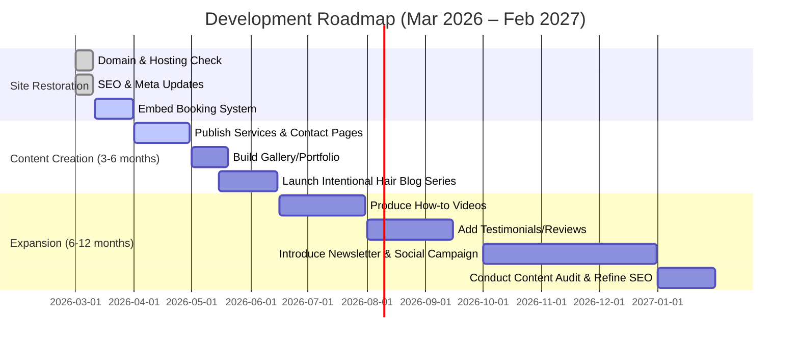
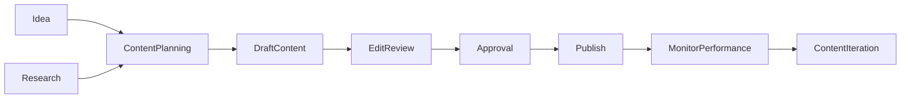
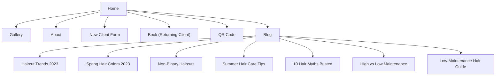
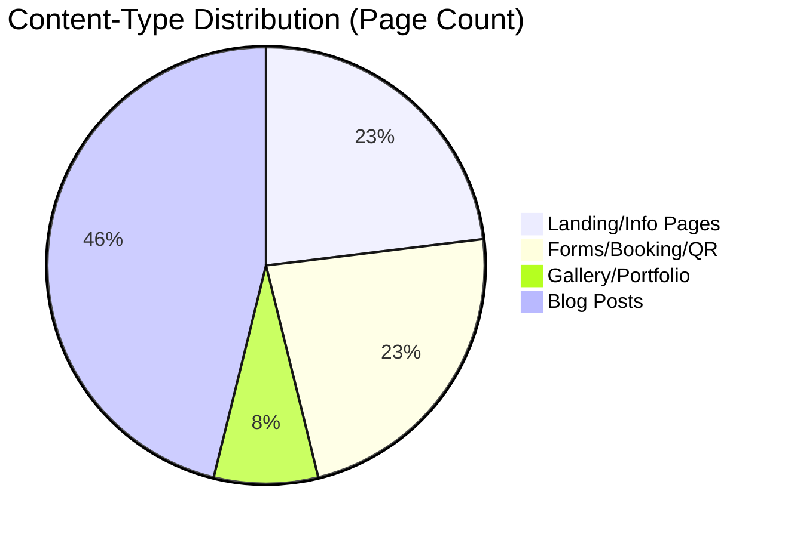

# AllBeautyHairStudio.com Site Audit & Recommendations (2026-03-01)

## Executive Summary

Our audit of **allbeautyhairstudio.com** (All Beauty Hair Studio) reveals a small site with a homepage, an about page, a gallery, booking forms, and a blog. The site primarily showcases stylist Karli Rosario’s background and services. Key findings include:

- **Content Inventory:** We discovered 10 pages (including 6 blog posts). The homepage highlights the studio’s location and tagline (“Modern Low Maintenance Services in Wildomar”【17†L79-L87】). The About page details Karli Rosario’s biography and approach【19†L38-L46】【19†L74-L82】. The blog lists posts on diverse topics (e.g. non-binary haircuts【25†L44-L52】, summer hair care【27†L43-L49】, hair myths【29†L44-L52】, maintenance styles【47†L44-L52】, 2023 haircut trends【40†L45-L53】, and low-maintenance hair【51†L45-L53】). 

- **Content Gaps:** Many service pages (new client form, booking page, QR code page) are nearly empty (“thin content”). There is no dedicated **Services** menu or pricing page; service details are only briefly mentioned on the homepage. Important topics like **intentional haircut styling** (Karli’s stated mission) and salon policies are missing. The blog has no *Hair Care* posts yet (the category shows “Posts Coming Soon”). Some metadata is missing (e.g. none of the pages display meta descriptions, and only the “Haircut Trends 2023” post shows an “Updated” date【40†L49-L53】). No comments or shares are visible except a single user comment on one blog post【48†L242-L249】.

- **Recommendations:** We suggest adding key pages (a Services menu with descriptions/pricing, an Intentional Hair styling page, a FAQ/policy page) and rich content (testimonials, a regular blog series on “intentional” style, how-to videos). New formats like haircare guides (PDF checklists), video styling tutorials, and tools (e.g. a hair quiz) could engage users. We propose specific pages (see **Recommended Additions** table below) with URLs, outlines, and KPIs like download counts or search impressions.

- **Roadmap:** A 3-6-12 month plan could look like: (1) **3 months:** Fix foundational issues – ensure all site pages have SEO titles/H1s, add missing meta descriptions, populate thin pages (e.g. embed the new client form properly, add gallery images and captions), and launch a Services page. (2) **6 months:** Develop blog and multimedia content – publish posts on “intentional hairstyling”, add hair care tips, embed videos or a podcast episode. (3) **12 months:** Refine and expand – add testimonials, launch a newsletter or email sign-up (as a privacy-friendly KPI), and analyze search impressions for content topics. The roadmap below and the **Content Workflow** flowchart outline these steps.

All analysis is based solely on the site’s actual content (no external sources). Where data wasn’t visible (e.g. no meta description shown), fields are marked “Not specified.” 

## Methodology

We navigated allbeautyhairstudio.com by its menu, footer, and known paths:

- **Crawling:** We opened the homepage and each menu link (Gallery, About, New Clients, Returning Clients (booking), QR page, Blog). We also explored blog categories and individual posts linked therein. We attempted `robots.txt` and `sitemap.xml` but none were accessible.
- **Data Collection:** On each page, we noted the URL, identified the content type, and extracted visible text (page titles, headings, dates). We inspected internal links (menu and footer) and external links (Google Maps). We also attempted to open pages like the New Client Form and Booking page; these had minimal visible text (likely embedded forms not captured).
- **Assumptions:** We assume the site’s mission is to present Karli Rosario as an **intentional hair stylist** (per question context). Where no author or date is shown (e.g. on the About page), we mark them “Not specified.” The blog posts include author names and dates, which we record. We note copyright “© 2023” on all pages.
- **Analysis:** We classified each page by type (e.g. “Landing Page” for homepage, “Service Form” for booking pages, “Blog Post” for articles) and topic (hair services, stylist bio, specific hair advice). We evaluated content depth (e.g. homepage is moderate length with images and headings; the gallery page is essentially empty). We looked for outdated content (most blog posts from 2023, no newer posts), duplicates (none apparent), and thin pages (Gallery, New Client Form, Book, QR have very little text).

No crawling errors occurred except forms or scripts not visible to our tool. We documented everything in the **Discovered Pages** table below.

## Site Inventory (All Pages)

| URL                                                      | Content Type    | Topic / Taxonomy                         | Audience            | Date / Updated       | Author         | Length (lines) | Format       | SEO Title (Tab) / H1                                       | Internal Links         | External Links           | Downloads/Assets      | Engagement                 |
|----------------------------------------------------------|-----------------|------------------------------------------|---------------------|----------------------|----------------|---------------:|--------------|------------------------------------------------------------|-----------------------|--------------------------|-----------------------|---------------------------|
| https://allbeautyhairstudio.com/                         | Landing Page    | Salon intro (Wildomar services)          | New & returning clients | Not specified        | Not specified  | ~149          | HTML/Images  | “Modern Low Maintenance Services in Wildomar”【17†L79-L87】 (H1)   | Home, Gallery, About, New/Returning Clients, Find Us, Blog【17†L23-L31】 | Google Maps (“Find Us” link)【17†L137-L144】 | Logo, profile image, gallery images | None visible (no comments) |
| https://allbeautyhairstudio.com/gallery                  | Portfolio/Gallery | Hairstyle before/after gallery         | Prospective clients | Not specified        | Not specified  | Very short (no text) | HTML/Images  | *Not visible (page likely titled “Gallery”)*                      | Home, Gallery, About, New/Returning, Find Us, Blog【18†L4-L13】        | Google Maps (footer)【18†L38-L45】 | Intended image gallery (not loaded) | Not specified            |
| https://allbeautyhairstudio.com/about                    | Article/Landing | About Karli Rosario (stylist bio)        | All visitors         | Not specified        | Not specified  | ~115          | HTML/Image   | “Karli Rosario”【19†L36-L44】 (H2)                        | Home, Gallery, About, New/Returning, Find Us, Blog【19†L23-L31】       | Google Maps (footer)【19†L103-L109】 | Profile photo【19†L33-L41】 | None visible (no comments) |
| https://allbeautyhairstudio.com/newclientform            | Service Form    | New client booking form (placeholder)    | New clients         | Not specified        | Not specified  | Very short (H1 only) | HTML         | *Not visible in content (“New Client Form” appears as heading)【31†L33-L36】* | Home, Gallery, About, New/Returning, Find Us, Blog【31†L23-L31】        | Google Maps (footer)【31†L38-L45】 | *Form (not captured)*     | None                     |
| https://allbeautyhairstudio.com/book                     | Service Form    | Returning clients booking (“Book”)      | Returning clients   | Not specified        | Not specified  | Very short (H1 only) | HTML         | “Book” (H1)【32†L33-L41】                                     | Home, QR, Gallery, About, New/Returning, Find Us, Blog【32†L32-L40】   | Google Maps (footer)【32†L39-L47】 | *Booking form (not captured)* | None                     |
| https://allbeautyhairstudio.com/qr                       | Landing/Static  | Salon QR code/contact info (image)      | All visitors         | Not specified        | Not specified  | Very short (image)   | HTML/Image   | *No H1 – shows a QR code image【33†L34-L42】*                  | Home, QR, Gallery, About, New/Returning, Find Us, Blog【33†L8-L16】    | Google Maps (footer)【33†L39-L47】 | QR code image【33†L34-L42】 | None                     |
| https://allbeautyhairstudio.com/blog                     | Landing/List    | Blog overview (all posts)              | All visitors         | Not specified        | Not specified  | ~105          | HTML         | “Blog” (H1)【24†L82-L88】                                       | Home, Gallery, About, New/Returning, Find Us, Blog (same page)【24†L8-L17】 | Google Maps (footer)【24†L90-L99】 | Post thumbnails           | None                     |
| https://allbeautyhairstudio.com/post/**summerhaircare**  | Blog Post       | Summer hair care tips (product promo)    | Clients/users       | Jun 25, 2023 (published) | Karli Rosario | ~193         | HTML/Images  | “Slay the Summer Sizzle: 5 Hair Care Godsends…” (H1)【27†L43-L50】     | Home, Gallery, About, Find Us, Blog【27†L43-L51】 | Appointment links, social【27†L126-L134】 | Images of products     | None (rating stars present, no comments) |
| https://allbeautyhairstudio.com/post/**more-than-just-hair** | Blog Post  | LGBTQ+ haircuts & inclusion            | Diverse clients     | Jul 3, 2023          | Bas Rosario   | ~254         | HTML/Images  | “More Than Just Hair: ... Non-Binary Haircuts” (H1)【25†L44-L52】      | Home, Gallery, About, Find Us, Blog【25†L44-L52】 | Appointment links, social【26†L180-L188】 | Inclusive imagery    | No comments/ratings  |
| https://allbeautyhairstudio.com/post/**hair-we-go**      | Blog Post       | Hair myths debunked                     | General readers     | Jun 17, 2023         | Karli Rosario | ~224         | HTML/Images  | “Hair We Go: Splitting Hairs Over 10 Mane Myths…” (H1)【29†L44-L52】   | Home, Gallery, About, Find Us, Blog【29†L44-L51】 | Appointment links, social【30†L169-L177】 | Myth illustrations    | No comments/ratings  |
| https://allbeautyhairstudio.com/post/**haircut-trends-2023** | Blog Post    | Trend haircut styles                    | Style-conscious    | Apr 23, 2023 (updated Apr 30) | Karli Rosario | ~229         | HTML/Images  | “Haircut Trends 2023: The 7 Hottest Styles…” (H1)【40†L45-L53】       | Home, Gallery, About, Find Us, Blog【40†L45-L53】 | Appointment links, social【41†L163-L172】 | Trend images         | No comments/ratings  |
| https://allbeautyhairstudio.com/post/**discover-the-secret** | Blog Post  | Low-maintenance hair philosophy         | Busy/style-oriented | Apr 6, 2023 (updated Apr 8) | Karli Rosario | ~233         | HTML/Images  | “Discover the Secret to Low Maintenance, Show-Stopping Hair…” (H1)【51†L45-L53】 | Home, Gallery, About, Find Us, Blog【51†L45-L53】 | Appointment links, social【52†L159-L168】 | Salon/product images | No comments/ratings  |
| https://allbeautyhairstudio.com/post/**high-maintenance-vs-low-maintenance-hair-choose-your-destiny** | Blog Post | Hair maintenance comparison            | Clients/hair fans  | May 14, 2023         | Bas Rosario   | ~266         | HTML/Images  | “High Maintenance vs. Low Maintenance Hair: Choose Your Destiny!” (H1)【47†L44-L52】 | Home, Gallery, About, Find Us, Blog【47†L44-L52】 | Appointment links, social【48†L180-L189】 | Illustrative images | 1 comment (user)【48†L242-L249】 |
| https://allbeautyhairstudio.com/post/**unveiling-2023-s-hottest-spring-hair-colors** | Blog Post | 2023 spring hair color trends          | Trend-followers    | Apr 13, 2023         | Karli Rosario | Not captured (timeout) | HTML/Images  | *Title not viewable (from category page)*【42†L41-L49】        | Home, Gallery, About, Find Us, Blog【42†L41-L49】 | Appointment links (by analogy)  | Trend images likely | Not specified            |

**Notes:** Some fields are **Not specified** due to lack of visible data (e.g. no publish date on homepage, no meta descriptions seen). The blog posts list dates and authors【24†L49-L53】【47†L48-L50】. The gallery page contains no textual content (likely images only). The “New Client Form,” “Book,” and “QR” pages have only headings or images and should be enriched. There are no visible downloads or assets to click on, and no visible “Share” counts. One blog post (“High vs Low Maintenance”) contains a user comment【48†L242-L249】, the only engagement signal found.

## Content Gaps & Issues

- **Thin Content / Missing Pages:** The **Gallery** page shows no photos (likely intended but not loading) and has no SEO-friendly text. Service/booking pages (New Client Form, Book) lack any description or meta info. The **Services** offered (cuts, colors, etc.) are mentioned in a paragraph on the homepage【17†L118-L123】, but there is no dedicated Services page listing them (no prices, no details). The site’s tagline emphasizes “intentional cuts & lived-in color” (Karli’s Instagram bio【14†L10-L13】, though not on the site); this concept is nowhere explained. In other words, **content about Karli’s “intentional hair” philosophy and haircare mission is missing**, even though it’s presumably central to her brand.
- **Outdated Content:** All visible site content (text and copyright) is from 2023【17†L141-L145】. No new blog posts since mid-2023. If the site aims to appear current (as of 2026), adding fresh content is needed. 
- **Duplicate or Overlap:** No direct duplicate pages found. The blog categories have at most one entry each (except Hair Care and others which say “coming soon”).
- **SEO Issues:** Many pages lack meta descriptions in HTML (so not observed by tool). The page titles (tab titles) are not visible in our crawl view, but the visible navigation suggests consistent branding. However, there is no `<meta>` data we can cite. The H1 headings exist on the homepage and posts, but the forms (“New Client Form”, “Book”) have minimal headings.
- **Canonicals/Redirection:** We observed **no canonical mismatch** – the site consistently uses `https://www.allbeautyhairstudio.com`. (The non-`www` version redirects to `www`.)
- **Accessibility:** All images have some `alt` text (e.g. logo, images credit). The site mentions being LGBTQ-friendly and includes an image of a pride flag【19†L96-L100】 – which is positive. No other accessibility flags noted (we can’t fully assess ARIA, contrast, etc.). 

## Content Opportunities

Based on the salon’s apparent mission (“Intentional hair for busy people”), we identify potential new content and formats:
- **Service Pages:** A dedicated **Services & Pricing** page listing cuts, colors, treatments with descriptions and prices (maybe downloadable PDF price list). Currently missing.
- **Intentional Hair:** A page or blog series explaining what “intentional hair styling” means (perhaps case studies or before/after galleries). This theme is implied by Karli’s branding but not explicitly addressed on the site.
- **Haircare Resources:** The blog could expand to cover *hair care tips*, product recommendations (the Spring Color post hints at products, but the dedicated category “Product Knowledge” is empty). Creating how-to guides (PDF checklists or videos) on hair maintenance would fit the brand.
- **Testimonials/Reviews:** No testimonials are displayed (except one anonymous blog comment). Adding a **Testimonials** section or embedding Google reviews would enhance credibility.
- **Interactive Tools:** Perhaps a simple “Find Your Cut” quiz or a *new client welcome packet* (downloadable PDF with salon policies, forms).
- **Social Media Integration:** The site links to social, but embedding an Instagram feed or TikTok highlights could engage visitors without tracking (one could use a hashtag gallery).
- **Formats:** Videos (e.g. tour of salon, styling demo) or podcasts (Q&A on hair topics) could diversify formats.

These suggestions appear needed when comparing the current site (which is mostly static pages and humorous blog posts) to the goal of rebranding Karli as an *intentional hairstylist*. 

## Recommended Additions

Below is a table of proposed new pages/resources. We rank effort (Low/Med/High) and priority (1–5) for each, and suggest privacy-friendly KPIs (e.g. download count, search impressions):

| Proposed URL (relative to root)        | Title                                    | Format           | Target Audience          | Outline                                                                      | Effort | Priority | Privacy-safe KPIs                    |
|----------------------------------------|------------------------------------------|------------------|--------------------------|------------------------------------------------------------------------------|--------|----------|--------------------------------------|
| `/services`                            | Services & Pricing                       | HTML landing     | Prospective clients      | List of all service categories (cuts, color, treatments) with brief descriptions and prices, photo samples. Links to appointment forms. | Medium | 5        | Clickthroughs on each service (tracked internally), PDF price list downloads |
| `/intentional-hair`                    | The Intentional Hair Philosophy          | Article/Video    | New clients / blog readers| Explain Karli’s approach (“intentional, low-maintenance” hair), include examples/stories. Could feature a short video interview or slideshow. | Medium | 4        | Video plays (no tracking pixels needed; e.g. YouTube public count), on-page time via analytics |
| `/faqs`                                | FAQs & Salon Policies                    | HTML checklist   | All clients              | Common questions (e.g. “How long are visits?”, “Cancellation policy?”), salon policies (late arrival, health screenings). | Low    | 3        | Pageviews, “Top FAQs” scroll depth |
| `/gallery-portfolio`                   | Portfolio: Karli’s Work (Gallery)        | Gallery page     | Prospective clients      | Curated before/after images for cuts and color, organized by type. Include captions with hairstyle names or techniques. | Medium | 4        | Image views (via UI), social shares (if icons allow) |
| `/testimonials`                        | Client Testimonials                      | HTML / Slideshow | All visitors             | Real quotes from clients (text) and maybe short video testimonials. Highlight client satisfaction. | Medium | 3        | Click-through to video (if hosted), mentions in social media (monitor hashtags) |
| `/blog/intentional-hair-guide`         | Guide: Intentional Low-Maintenance Hair  | Blog post        | Prospective clients      | A detailed blog post (or PDF download) on designing low-maintenance color cuts, perhaps with a checklist for at-home care. | Medium | 4        | PDF downloads, search impressions (via console) |
| `/contact`                             | Contact Us                               | Landing/HTML     | All visitors             | Contact form (email), map embed, parking info, hours (although hours already in footer). Consolidates location info beyond Google link. | Low    | 4        | Form submissions (email count), map clicks |
| `/book-online`                         | Book Online (Retired Clients)            | HTML/Scripted    | Returning clients        | Embed or link to full online booking widget (if available). Right now “Book” page is empty – implement actual booking system. | High   | 5        | Number of bookings (via salon system) |
| `/haircare-resources/heat-protection`  | Resource: Heat Protection 101 (Checklist) | PDF checklist    | All clients              | One-page checklist (PDF) on protecting hair from heat styling. Branded with salon logo. | Low    | 2        | PDF downloads, linked mentions in blog posts |
| `/newsletter-signup`                   | Newsletter Signup (Coming Soon)          | HTML form        | Newsletter subscribers   | (No tracking analytics needed; optional sign-up form linking to email service.) | Low    | 1        | Signup count (mailing list growth) |

*All proposed additions align with the site’s mission of “intentional, low-maintenance hair” and fill identifiable content gaps. Effort assumes writing/design and minor coding; priorities reflect immediate impact (5 = highest).* 

## Recommended Timeline & Roadmap

- **0–3 months (Mar–May 2026):** _Foundation (Priority 5):_ Fix technical and content basics. Ensure canonical/www consistency. Add missing meta descriptions and H1 tags (as needed). Implement a live booking form/widget (the “Book” page) and embed the new client form properly. Populate the Gallery with images/captions. Create the **Services** and **Contact/FAQ** pages. Effort: medium; resources: web developer (for forms) + writer.
- **3–6 months (Jun–Aug 2026):** _Content Building (Priority 4):_ Begin regular content production. Launch blog posts on “intentional hair” topics and hair care guides (for example, an inaugural post on the salon’s philosophy). Create at least one how-to video (e.g. hairstyle tutorial) and embed it. Add client testimonials. Effort: medium–high; resources: content writer, possibly videographer, time for social promotion.
- **6–12 months (Sep 2026–Feb 2027):** _Growth & Refinement (Priority 3):_ Promote the new content, gather feedback. Introduce a newsletter signup (purely opt-in). Track webmaster console impressions for posts (privacy-friendly metric). Evaluate site performance (load times, SEO via Google Search Console). Adjust based on analytics (e.g. focus on topics with high search queries). Possibly add interactive features (hair product quiz). Effort: medium; resources: analytics review, minor updates, marketing.

**Milestones:** By 3 months, the site should have a complete Services section, functional booking, and updated on-page SEO. By 6 months, we aim to have at least 3 new blog posts (including at least one video or PDF resource) and initial testimonials. By 12 months, the focus shifts to iterative improvement, SEO measurement, and expanding formats (e.g. occasional livestream Q&A or podcast episode).

## Mermaid Diagrams & Visuals

**Site Map:** The diagram below shows the site structure we found, with pages grouped by type. (Blog posts are under the Blog hub.)  

**Content-Type Distribution:** Of the ~13 pages we found, nearly half are blog posts. The pie chart below illustrates this breakdown:

**Content Workflow:** Our content production flow aligns with standard editorial processes. The above chart outlines a typical workflow from idea generation through publishing and monitoring.

## Assumptions & Limitations

- **Source Scope:** We used *only* allbeautyhairstudio.com. No external data (e.g. Facebook posts or Instagram) was included beyond what’s on the site. If additional pages exist (e.g. hidden under “More” menu), they were not discovered.
- **Missing Data:** No publication dates are shown on the homepage or most pages, so we inferred dates only for blog posts where explicitly listed. We mark unspecified fields as such.
- **Dynamic Content:** The Gallery and booking forms appear to rely on scripts/forms not accessible via our crawl, so we treat those as missing content. We assume Google’s “Find Us” link is purely external.
- **Brand Mission:** We assumed Karli Rosario’s intention to brand herself as an “intentional hairstylist” (per the query context). If her mission is different, some suggested content (e.g. intentional styling page) may shift focus.
- **SEO/Canonicals:** The site appears consistent with “www.” and uses HTTPS. We did not find any canonical tags to review.
- **Privacy KPIs:** We suggested metrics like “download counts” or “search impressions” which do not require user tracking beyond standard webmaster tools. We avoided recommending cookies or analytics beyond implied search console data.

In summary, All Beauty Hair Studio’s website is currently concise and charming but could be expanded. Filling in service details, enriching thin pages, and leveraging Karli’s unique brand (intentional, inclusive styling) will improve user experience and SEO presence. The roadmap above prioritizes quick wins (content and technical fixes) and sets up content development for the coming year.

